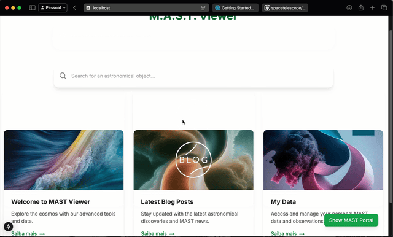

# AESo




## Visão Geral

AESo/MAST Viewer é um projeto pessoal front-end ambicioso que visa criar uma interface intuitiva e amigável para busca, download e manipulação de dados astronômicos. Inicialmente focado no MAST Portal [(Mikulski Archive for Space Telescopes)](https://mast.stsci.edu/portal/Mashup/Clients/Mast/Portal.html)
, o projeto tem como objetivo expandir para outros catálogos e arquivos no futuro.

## Objetivos

- 🔍 Busca avançada de objetos
- 📊 Visualização integrada do MAST Portal de forma nativa e acessível.
- 🌌 Suporte a imagens FITS e espectros, e tratamento de dados e imagem (com limites) online.
- 🎨 Interface imersiva c/ Animações fluidas e feedback visual
- 🔄 Integração em tempo real com APIs 

## Stack Tecnológica/Roadmap

- [Next.js 15](https://nextjs.org/)

<details>
<summary>...</summary>

- [React 18](https://react.dev/)
- [TypeScript](https://www.typescriptlang.org/)
- [Tailwind CSS](https://tailwindcss.com/)
- [framer-motion](https://www.framer.com/motion/)
- [lucide-icons](https://lucide.dev/)
- [pnpm](https://pnpm.io/)
- [Python](https://www.python.org/)
- ...

</details>

- ### Visão Futura
    - Expandir o suporte para outros catálogos e arquivos astronômicos.
    - Implementar um sistema robusto de machine learning para melhorar a interação com dados complexos.
    - Desenvolver um sistema de segurança avançado para garantir a privacidade de usuários, dados, empresas e institutos.
    - ...


## Instalação

```bash
# Clone o repositório
git clone https://github.com/fabriciort/aeso.git

# Instale as dependências
cd aeso
pnpm install

# Inicie o servidor de desenvolvimento
pnpm run dev
```

## Roadmap

- [ ] Implementação de autenticação
- [ ] Sistema de coleções
- [ ] Exportação de dados em múltiplos formatos, e compactações
- [ ] Análise e filtragem de dados com machine learning
- [x] ...

## Licença e Atribuições

O projeto utiliza um modelo de **licenciamento dual**:

### Código Fonte ([MIT License](LICENSE-MIT))
O código fonte, que podem incluir componentes, configurações e scripts está sob a licença MIT:
- Arquivos `.ts`, `.tsx`, `.js`, `.py`, `.ipynb`, `.json`, etc.****
- Configurações (`.config.js`, etc.)
- Scripts de build e desenvolvimento

### Conteúdo e Documentação ([CC BY-SA 4.0](LICENSE-CC-BY-SA))
O conteúdo, documentação e assets está sob Creative Commons BY-SA 4.0:
- Documentação (`.md`, etc.)
- Imagens e mídia
- Textos e descrições
- Dados derivados e visualizações

### Dados Externos
Os dados, imagens equaisquer conteúdos do MAST/STScI estão sujeitos às suas próprias licenças:
- [STScI Copyright](https://www.stsci.edu/copyright)
- [STScI Privacy Policy](https://www.stsci.edu/privacy)
- [MAST Data Usage](https://archive.stsci.edu/publishing/data-use)

### Estrutura de Licenciamento

```
aeso/
├── LICENSE-MIT       
├── LICENSE-CC-BY-SA  
├── app/              # MIT License
│   ├── components/   # MIT License
│   ├── lib/         # MIT License
│   └── ...
├── public/          # CC BY-SA 4.0
│   └── assets/      # CC BY-SA 4.0 (exceto conteúdo MAST)
└── README.md        # MIT License
```

- Flexibilidade para reutilização do código (MIT)
- Proteção e atribuição adequada do conteúdo (CC BY-SA 4.0)
- Conformidade com licenças de dados externos
- Clareza sobre o que pode ser usado e como

## Status

🚧 Contribuições são bem-vindas!

---

Desenvolvimento movido a paixão 💚 e curiosidade pelo cosmos
