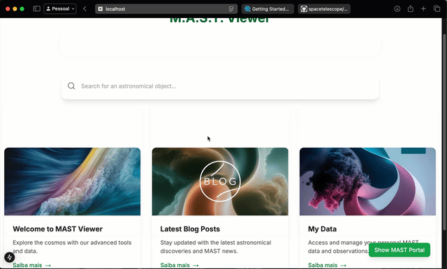

# AESo




## Visão Geral

**AESo** é uma plataforma para aprender física e astronomia fazendo ciência de verdade. O aluno imagina um fenômeno, testa uma hipótese e mede o resultado em dados reais de telescópios. Tudo em português, direto no navegador.

- **Site** (`/`): apresenta o produto.
- **Observatório** (`/app`): o web app. É um ambiente contínuo, com abertura animada, boas-vindas e áreas que trocam sem recarregar a página:
  - **Início**: continuar de onde parou, objeto do dia, buscas recentes.
  - **Céu**: busca por nome, catálogo, coordenadas ou características; céu interativo (Aladin Lite); ficha do objeto; observações e downloads do MAST.
  - **Laboratórios**: experiências guiadas. O primeiro, *Encontre um exoplaneta*, usa a curva de luz real do TESS para medir o tamanho de WASP-121 b.
  - **Vega**: guia de IA que sabe em que etapa o aluno está e dá pistas em vez de respostas.

## Documentação

| Documento | Conteúdo |
|---|---|
| [docs/PRODUTO.md](docs/PRODUTO.md) | Visão, público, princípios de experiência, **nomenclatura**, voz e tom |
| [docs/DESIGN.md](docs/DESIGN.md) | Tipografia, cor, movimento, abertura, layout |
| [docs/LABORATORIOS.md](docs/LABORATORIOS.md) | Como criar um novo laboratório |
| [docs/ARQUITETURA.md](docs/ARQUITETURA.md) | Estrutura do código, IA, fontes de dados, modo offline |

## Stack

Next.js 15 · React 19 · TypeScript · Tailwind CSS · framer-motion · Aladin Lite 3 · Geist · zod · Groq (ou Claude) · vitest

## Instalação

```bash
git clone https://github.com/fabriciort/aeso.git
cd aeso
pnpm install
cp .env.example .env.local   # GROQ_API_KEY para ativar a Vega
pnpm dev                     # http://localhost:3000
```

```bash
pnpm dev:mock    # dados simulados, sem rede
pnpm test        # testes (física do trânsito, leitor FITS, busca, ADQL)
pnpm lint && pnpm typecheck
pnpm build && pnpm start
```

## Roadmap

- [x] Céu: busca inteligente, céu interativo, dados do MAST
- [x] Observatório: abertura, boas-vindas, navegação contínua
- [x] Laboratório 1: Encontre um exoplaneta (TESS)
- [x] Vega, guia de IA
- [ ] Laboratórios: cor das estrelas, diagrama H-R (Gaia), expansão do universo, órbitas
- [ ] Contas, Caderno do aluno e planos pagos
- [ ] Biblioteca: artigos vivos
- [ ] Turma: painel do professor

## Licença e Atribuições

O projeto utiliza um modelo de **licenciamento dual**:

### Código Fonte ([MIT License](LICENSE-MIT))
O código fonte, que podem incluir componentes, configurações e scripts está sob a licença MIT:
- Arquivos `.ts`, `.tsx`, `.js`, `.py`, `.ipynb`, `.json`, etc.****
- Configurações (`.config.js`, etc.)
- Scripts de build e desenvolvimento

### Conteúdo e Documentação ([CC BY-SA 4.0](LICENSE-CC-BY-SA))
O conteúdo, documentação e assets está sob Creative Commons BY-SA 4.0:
- Documentação (`.md`, etc.)
- Imagens e mídia
- Textos e descrições
- Dados derivados e visualizações

### Dados Externos
Os dados, imagens equaisquer conteúdos do MAST/STScI estão sujeitos às suas próprias licenças:
- [STScI Copyright](https://www.stsci.edu/copyright)
- [STScI Privacy Policy](https://www.stsci.edu/privacy)
- [MAST Data Usage](https://archive.stsci.edu/publishing/data-use)

Este projeto usa o SIMBAD, o Sesame, o hips2fits e o Aladin Lite, operados pelo CDS (Strasbourg, França). Ao publicar resultados, cite o [SIMBAD](https://cds.unistra.fr/help/acknowledgement/) e o [Aladin](https://aladin.cds.unistra.fr/). O Aladin Lite é distribuído pelo CDS sob licença LGPL-3.0 e é usado como dependência npm, sem modificações.

### Estrutura de Licenciamento

```
aeso/
├── LICENSE-MIT       
├── LICENSE-CC-BY-SA  
├── app/              # MIT License
│   ├── components/   # MIT License
│   ├── lib/         # MIT License
│   └── ...
├── public/          # CC BY-SA 4.0
│   └── assets/      # CC BY-SA 4.0 (exceto conteúdo MAST)
└── README.md        # MIT License
```

- Flexibilidade para reutilização do código (MIT)
- Proteção e atribuição adequada do conteúdo (CC BY-SA 4.0)
- Conformidade com licenças de dados externos
- Clareza sobre o que pode ser usado e como

## Status

🚧 Contribuições são bem-vindas!

---

Desenvolvimento movido a paixão 💚 e curiosidade pelo cosmos
